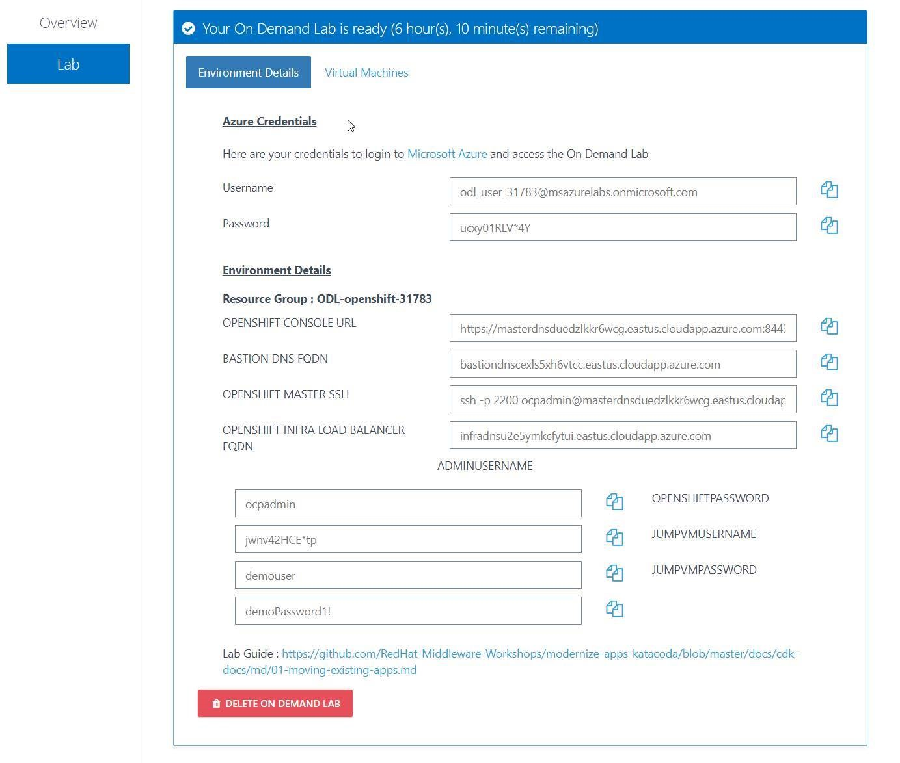
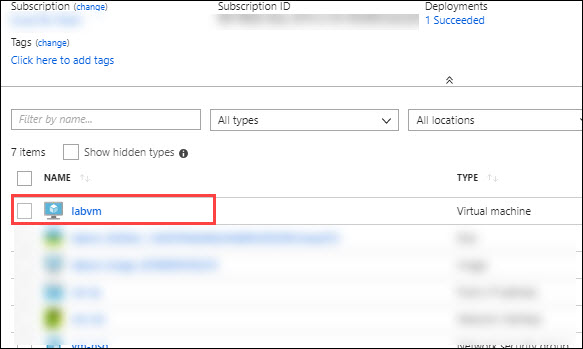
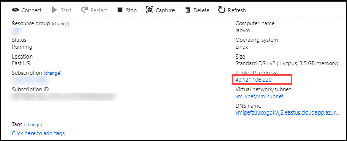
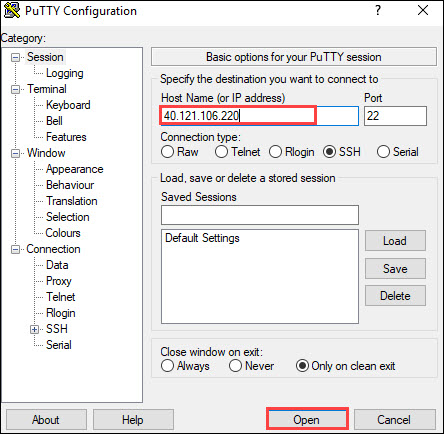
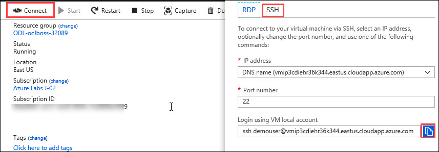
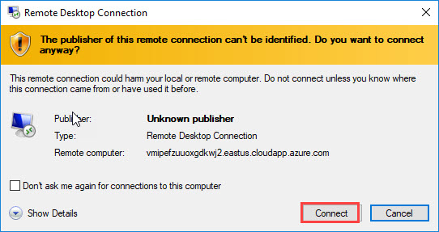
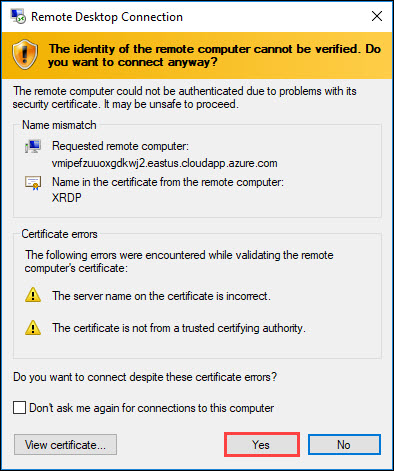
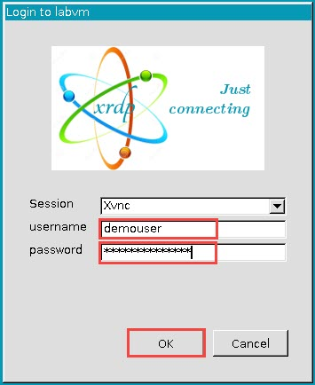

# Scenario Index

* Scenario 1 - [Moving existing apps to the cloud](01-moving-existing-apps.md)

* Scenario 2 - [A Developer Introduction to OpenShift](02-developer-intro.md)

* Scenario 3 - [Transforming an existing monolith (Part 1)](03-mono-to-micro-part-1.md)

* Scenario 4 - [Transforming an existing monolith (Part 2)](04-mono-to-micro-part-2.md)

* Scenario 5 - [Building Reactive Microservices](05-reactive-microservices.md)

* Scenario 6 - [Prevent and detect issues in a distributed system](06-resilient-apps.md)

# Monoliths to Microservices: App Transformation Hands-on Workshop

 These documents contains a complete set of instructions for running the workshop, split into different _scenarios_. You can use these documents as a companion as you progress through the scenarios, but keep in mind that some of the links in this document may not work as they will be specific to your online environment. You will be expected to substitute your own values for the following URLs:

 * **$OPENSHIFT_MASTER** - When you see this variable, replace it with the value of your own OpenShift master hostname/port, such as `https://master.openshift.com:8443` (be sure to include the port!).

 * **$ROUTE_SUFFIX** - When you see this variable, replace it with the value of your own OpenShift default routing suffix. For example, if you see `http://coolstore-dev.$ROUTE_SUFFIX` then you would replace this with `http://coolstore-dev.apps.mycompany.com` assuming your OpenShift cluster uses a default routing suffix of `apps.mycompany.com`.

# Intro

As modern application requirements become more complex, it’s apparent that one runtime, one
framework, or one architectural style is no longer a feasible strategy. Organizations must figure out how
to manage the complexity of distributed app development with diverse technologies, a lack of skilled
resources, and siloed processes.

In this hands-on workshop you’ll learn about:

* Migrating an existing legacy Java™ EE app to [Red Hat JBoss
Enterprise Application Platform](https://developers.redhat.com/products/eap/overview/) on [OpenShift](https://developers.redhat.com/products/openshift/overview/).
* Using modern frameworks like [Spring Boot](https://projects.spring.io/spring-boot/), [Wildfly Swarm](http://wildfly-swarm.io),
[Eclipse Vert.x](http://vertx.io), and [Node.js](https://nodejs.org) to implement microservices and
replace monolithic functionality.
* Developing and deploying using [Red Hat OpenShift Container
Platform](https://developers.redhat.com/products/openshift/overview/), [Red Hat OpenShift Application Runtimes](https://developers.redhat.com/products/rhoar/overview/), and
DevOps processes.
* The benefits and challenges with microservices, including use
cases for reactive microservices.
* Preventing and detecting issues in a distributed system.
* API gateways and microservices.

# Accessing the lab and verifying pre-requisites

1. You can register for the lab by using the URL provided by the instructor. Open a browser, navigate to the given URL. Once you get in to the registration page, provide your details and click on **Submit**. Then in the next page that appear, click on **Launch lab** to start the deployment. 
<kbd></kbd>
2. Once the deployment is completed, you will receive the lab environment details via Email. Ensure that the lab environment details consist of two sections, **Azure Credentials** and **Environment Details.**
<kbd></kbd>
3. Navigate to https://portal.azure.com and login to **Azure** using the credentials given in the lab Environment details page.
4. Once you logged in to Azure, click on **Resource Groups** from the Menu bar.  
<kbd></kbd>
5. Ensure that you can access the **Resource group** and **Resources**. Select virtual machine named **labvm** from the list of resources in the Resource group. 
<kbd></kbd>
6. Copy the **Public IP Address** from the **Virtual Machine** page. 
<kbd></kbd>
7. **For windows Users :** Open **Putty**, **paste** the copied IP Address and click on **Open**. Then login with the **JumpVM Username** and **JumpVM Password** provided in the lab environment details page. 
<kbd></kbd>
8. **For Mac Users :** Select "**Connect**" from the virtual machine page, then select "**SSH**" tab, then click on the "**click-to-Copy**" icon at the end of the line, and finally paste the SSH string to an Xterm on Mac OS.
<kbd></kbd>

8. Once you logged in to **labvm**, verify the pre-requisites by running the following commands.
  *	**git --version** (it should be 2.7.2 or later)
  *	**java -version** (it should be 1.8.x or later)
  *	**oc** (ensure that this command is working, if not it will show Command not found.)
  *	**mvn --version** (it should be 3.3.9 or later)
  * Ensure that **Projects, rhamt-cli-4.0.0.Beta4 and jboss-eap-7.1.0.zip** folders are already present.

## Checking RDP connection to the LAB VM
### For Windows users
1. Navigate to https://portal.azure.com and login to **Azure** using the credentials given in the lab Environment details page. Click on the virtual machine, **labvm**. 
<kbd></kbd>
2. In the virtual machine page click on **Connect**. In the new blade that appear, click on **RDP** and select **Download RDP file**. 
<kbd></kbd>
3. Open the downloaded file and click on **Connect**. 
<kbd></kbd>
4. In the new blade that appear, click on **Yes**. 
<kbd></kbd>
5. Now in the Login page, provide the credentials as follows and click on **OK**.
* Username : **demouser**
* Password : **demoPassword1!** 
<kbd></kbd>

### For Mac users 
1. Before beginning, you will need to install the Microsoft Remote Desktop Application from Apple’s App Store:  https://itunes.apple.com/us/app/microsoft-remote-desktop/id1295203466?mt=12
2. Open the application and Click on the '+' symbol and select Desktop to add a new connection."
3. In the new window that appears, provide the following details and save the connection.
  * PC Name : *Provide the **Public IP Address** of the **labvm***
  * Connection Name : *Provide any connection name*
4.	Save the connection and close the dialog box.
5. Double click the newly created connection. If the "**verify certificate**" dialog appears, click on continue.
6. Then the following dialog will appear and ask you to authenticate.  Use your Jump VM Username and Jump VM Password to do this. 
* Username : **demouser**
* Password : **demoPassword1!** 
 <kbd></kbd>
 

